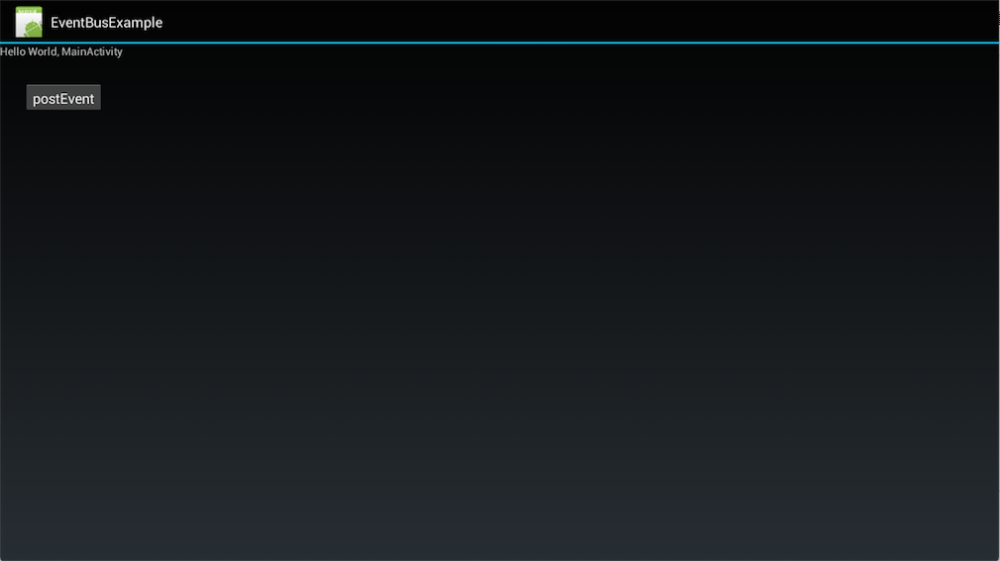
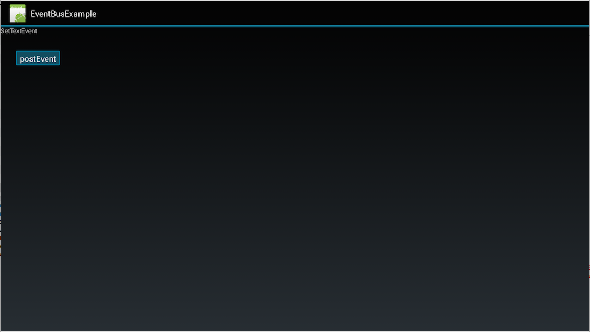

# EventBusExample
这是一个EventBus简单示例demo

在MainActivity中添加register和unregister; 事件的响应方法需要以“onEvent”开头，“MainThread”是表明执行在主线程中。

 	@Override
    protected void onResume() {
        super.onResume();
        EventBus.getDefault().register(this);
    }

    @Override
    protected void onStop() {
        super.onStop();
        EventBus.getDefault().unregister(this);
    }

    public void onEventMainThread(SetTextEvent event) {
        if (event.getText() != null) {
            mTVLabel.setText(event.getText());
        }
    }

在onClick中给接收者post消息

	@Override
    public void onClick(View v) {
        switch (v.getId()) {
        case R.id.btn:
            EventBus.getDefault().post(new SetTextEvent("SetTextEvent"));
            break;
        }
    }

app启动时的效果图如下：

    

此时TextView显示的是SetTextEvent，此时我们点击button，可以看到TextView的内容变为我们通过EventBus设置的“SetTextEvent”：

